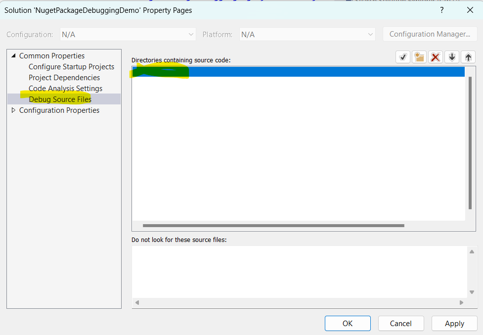
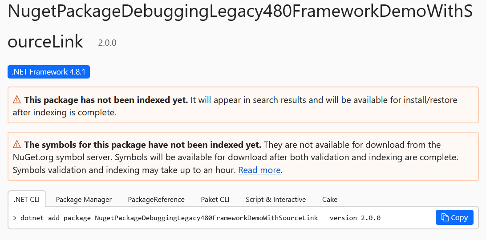
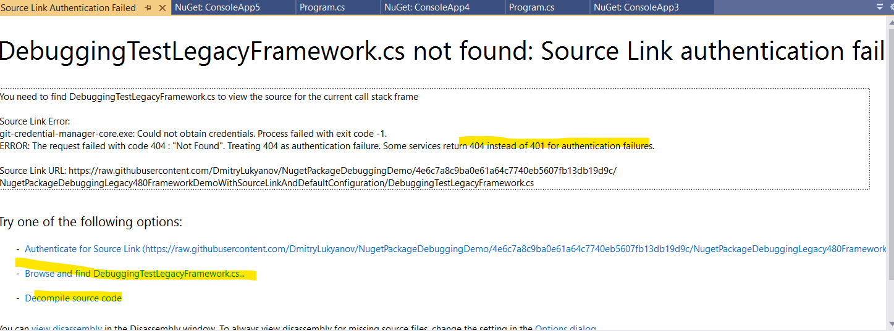

# 1. .NET Core/Latest frameworks

## Link: https://lurumad.github.io/using-source-link-in-net-projects-and-how-to-configure-visual-studio-to-use-it

## 1.1. SDK project (NugetPackageDebuggingDemo project):

1. Pack:

        dotnet pack .\NugetPackageDebuggingDemo.csproj -c Release -o .\artifacts --include-symbols

2. ls:

        PS C:\Git\NugetPackageDebuggingDemo\NugetPackageDebuggingDemo\artifacts> ls

             Directory: C:\Git\NugetPackageDebuggingDemo\NugetPackageDebuggingDemo\artifacts
 
 
        Mode                 LastWriteTime         Length Name
        ----                 -------------         ------ ----
       -a----        10/28/2024   5:39 PM           3641 NugetPackageDebuggingDemo.1.0.0.nupkg
       -a----        10/28/2024   5:39 PM           8425 NugetPackageDebuggingDemo.1.0.0.snupkg

3. Push:

      nuget push .\NugetPackageDebuggingDemo.1.0.0.nupkg 
        -Source https://api.nuget.org/v3/index.json 
        -ApiKey API_KEY

### Result
Everything works fine

# 2. Other tried and that doesn't work without additional configuration

> [!WARNING]
> If producing and consuming nugets happen on the same machine, it might be that additional configuration in the solution won't be required due to some "local cache" configuration. But when consuming happens on another machine, debug source configuration in the solution file will be mandatory.

## 2.1. Non SDK project and 4.8 monikers without Source Link package (NugetPackageDebuggingLegacy480FrameworkDemo project)

0. Project file:

        <TargetFrameworkVersion>v4.8</TargetFrameworkVersion>
        <DebugSymbols>true</DebugSymbols>
        <DebugType>portable</DebugType>

1. Pack with `-Symbols` and `-SymbolPackageFormat snupkg`

        nuget pack -IncludeReferencedProjects -Symbols -Build -OutputDirectory "artifacts" -SymbolPackageFormat snupkg

Pay attention on `-SymbolPackageFormat snupkg`

2. ls:

        cd .\artifacts\ 
        PS C:\Git\NugetPackageDebuggingDemo\NugetPackageDebuggingLegacy480FrameworkDemo\artifacts> ls

            Directory: C:\Git\NugetPackageDebuggingDemo\NugetPackageDebuggingLegacy480FrameworkDemo\artifacts

        Mode                 LastWriteTime         Length Name
        ----                 -------------         ------ ----
        -a----        10/29/2024   1:34 PM           3691 NugetPackageDebuggingLegacy480FrameworkDemo.1.0.0.nupkg
        -a----        10/29/2024   1:34 PM           3142 NugetPackageDebuggingLegacy480FrameworkDemo.1.0.0.snupkg

3. Push:
 
        nuget push .\NugetPackageDebuggingLegacy480FrameworkDemo.1.0.0.nupkg -Source https://api.nuget.org/v3/index.json -ApiKey API_KEY

### Result
The package and symbols file have been deployed to nuget.org. 
NOTE: no pdb file found

To allow debugging, do the following: 
1. Open solution settings in the consumer solution
2. Checked out the project that produced the nuget packages with right version of the code
3. Go to Common properties => Debug Source Files

4. Add the path to the solution folder into "Directory containing source code".
5. Click ok

## 2.2. Non SDK Project and default project configuration without Source Link package (NugetPackageDebuggingLegacyDefaultProjectDemo project)

1. Pack with only `-Symbols`

        nuget pack -IncludeReferencedProjects -Symbols -Build -OutputDirectory "artifacts"  -Version 4.0.0

2. ls: 
 
        ls

             Directory: ..
         
         
         Mode                 LastWriteTime         Length Name
         ----                 -------------         ------ ----
           -a----        10/29/2024   4:44 PM           7106 NugetPackageDebuggingLegacyDefaultProjectDemo.4.0.0.symbols.nupkg

3. Push:

        nuget push .\NugetPackageDebuggingLegacyDefaultProjectDemo.4.0.0.symbols.nupkg -Source https://api.nuget.org/v3/index.json -ApiKey API_KEY

### Result
Same as above, but pdb file is added to the bin folder. But configuring a source files in solution is still required

## 2.3. NonSDK with SourceLink nuget (NugetPackageDebuggingLegacy480FrameworkDemoWithSourceLink project)

0. Project file:

        <DebugType>portable</DebugType>
        <Optimize>true</Optimize>

1. Pack with `-Symbols` and `-SymbolPackageFormat snupkg`:

        nuget pack -IncludeReferencedProjects -Symbols -Build -OutputDirectory "artifacts" -SymbolPackageFormat snupkg -Version 2.0.0

2. ls

        PS C:\Git\NugetPackageDebuggingDemo\NugetPackageDebuggingLegacy480FrameworkDemoWithSourceLink\artifacts> ls

            Directory: C:\Git\NugetPackageDebuggingDemo\NugetPackageDebuggingLegacy480FrameworkDemoWithSourceLink\artifacts

        Mode                 LastWriteTime         Length Name
        ----                 -------------         ------ ----
        -a----         1/31/2025   4:23 PM           3840 NugetPackageDebuggingLegacy480FrameworkDemoWithSourceLink.2.0.0.nupkg
        -a----         1/31/2025   4:23 PM           3385 NugetPackageDebuggingLegacy480FrameworkDemoWithSourceLink.2.0.0.snupkg

3. Push:

        nuget push .\NugetPackageDebuggingLegacy480FrameworkDemoWithSourceLink.1.0.0.nupkg -Source https://api.nuget.org/v3/index.json -ApiKey API_KEY

### Result
1. The symbols are published. It's visible during validation on the portal

2. Consuming of this project doesn't allow step into the source without additional debug source configuration in the solution file.

## 2.4. NonSDK with SourceLink nuget (NugetPackageDebuggingLegacy480FrameworkDemoWithSourceLinkAndDefaultConfiguration project)

### 2.4.1. Debug mode (publish only .nupkg):

0. Project file:

        <DebugSymbols>true</DebugSymbols>
        <DebugType>full</DebugType>
        <Optimize>false</Optimize>

1. Pack:

      nuget pack -IncludeReferencedProjects -Symbols -Build -OutputDirectory "artifacts"

2. ls:

        PS C:\Git\NugetPackageDebuggingDemo\NugetPackageDebuggingLegacy480FrameworkDemoWithSourceLinkAndDefaultConfiguration\artifacts> ls

            Directory: C:\Git\NugetPackageDebuggingDemo\NugetPackageDebuggingLegacy480FrameworkDemoWithSourceLinkAndDefaultConfiguration\artifacts

        Mode                 LastWriteTime         Length Name
        ----                 -------------         ------ ----
        -a----         1/31/2025   4:41 PM           3956 NugetPackageDebuggingLegacy480FrameworkDemoWithSourceLinkAndDefaultConfiguration.1.0.0.nupkg
        -a----         1/31/2025   4:41 PM           7535 NugetPackageDebuggingLegacy480FrameworkDemoWithSourceLinkAndDefaultConfiguration.1.0.0.symbols.nupkg

3. Push (only .nupkg file):

        nuget push .\NugetPackageDebuggingLegacy480FrameworkDemoWithSourceLinkAndDefaultConfiguration.1.0.0.nupkg -Source https://api.nuget.org/v3/index.json -ApiKey API_KEY

#### Result
1. Symbols are not visible on nuget
2. Consuming doesn't allow step into debugging 

### 2.4.2. Debug mode (publish only .snupkg):
0. Project file:

        <DebugSymbols>true</DebugSymbols>
        <DebugType>full</DebugType>
        <Optimize>false</Optimize>

1. Pack:

        nuget pack -IncludeReferencedProjects -Symbols -Build -OutputDirectory "artifacts" -version 2.0.0

2. ls:

        PS C:\Git\NugetPackageDebuggingDemo\NugetPackageDebuggingLegacy480FrameworkDemoWithSourceLinkAndDefaultConfiguration\artifacts> ls

            Directory: C:\Git\NugetPackageDebuggingDemo\NugetPackageDebuggingLegacy480FrameworkDemoWithSourceLinkAndDefaultConfiguration\artifacts

        Mode                 LastWriteTime         Length Name
        ----                 -------------         ------ ----
        -a----         1/31/2025   4:50 PM           3955 NugetPackageDebuggingLegacy480FrameworkDemoWithSourceLinkAndDefaultConfiguration.2.0.0.nupkg
        -a----         1/31/2025   4:50 PM           7536 NugetPackageDebuggingLegacy480FrameworkDemoWithSourceLinkAndDefaultConfiguration.2.0.0.symbols.nupkg

3. Publish snupkg:

        nuget push .\NugetPackageDebuggingLegacy480FrameworkDemoWithSourceLinkAndDefaultConfiguration.2.0.0.symbols.nupkg -Source https://api.nuget.org/v3/index.json -ApiKey API_KEY_

#### Result:
1. Symbols are not visisble in portal UI
2. .pdb file exists in `bin/Debug` folder after consuming
3. Source Link is active but can't find the required .cs file.

Force auth call by clicking `Authenticate for Source link` doesn't help.
Therefore debugging doesn't allow a step into the source, however it's allowed after choosing `Decomplile` option, but it's not very reliable approach.

### 2.4.3 Release Mode (publish .snupkg)

0. Project file:

        <DebugType>pdbonly</DebugType>
        <Optimize>true</Optimize>

1. Pack:

        nuget pack -IncludeReferencedProjects -Symbols -Build -OutputDirectory "artifacts" -version 3.0.0 -Prop Configuration=Release

2. ls:

        PS C:\Git\NugetPackageDebuggingDemo\NugetPackageDebuggingLegacy480FrameworkDemoWithSourceLinkAndDefaultConfiguration\artifacts> ls                          

            Directory: C:\Git\NugetPackageDebuggingDemo\NugetPackageDebuggingLegacy480FrameworkDemoWithSourceLinkAndDefaultConfiguration\artifacts

        Mode                 LastWriteTime         Length Name
        ----                 -------------         ------ ----
        -a----         1/31/2025   5:02 PM           3964 NugetPackageDebuggingLegacy480FrameworkDemoWithSourceLinkAndDefaultConfiguration.3.0.0.nupkg
        -a----         1/31/2025   5:02 PM           7539 NugetPackageDebuggingLegacy480FrameworkDemoWithSourceLinkAndDefaultConfiguration.3.0.0.symbols.nupkg

3. Publish (.snupkg):

        nuget push .\NugetPackageDebuggingLegacy480FrameworkDemoWithSourceLinkAndDefaultConfiguration.3.0.0.symbols.nupkg -Source https://api.nuget.org/v3/index.json -ApiKey API_KEY_

#### Result
1. Symbols are not visisble in portal UI
2. .pdb file exists in `bin/Debug` folder after consuming
3. Source Link is active but can't find the required .cs file. 

Force auth call by clicking `Authenticate for Source link` doesn't help.
Therefore debugging doesn't allow a step into the source, however it's allowed after choosing `Decomplile` option, but it's not very reliable approach.